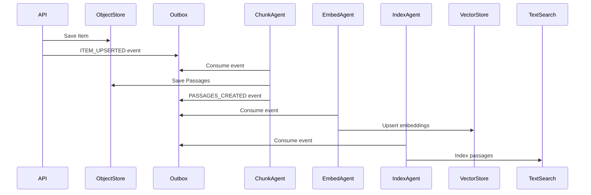
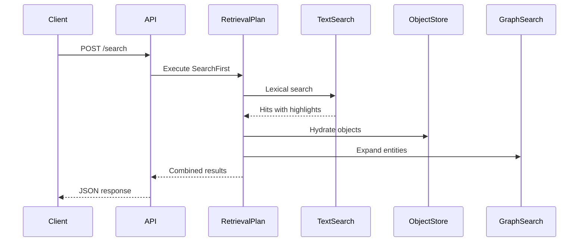

# Architecture Overview

cogmem-kos is designed as a **framework-agnostic knowledge layer** that any AI agent can plug into.

## Design Principles

<CardGroup cols={2}>
  <Card title="Contract-First" icon="file-contract">
    Core contracts define interfaces without importing provider clients
  </Card>
  <Card title="Provider Isolation" icon="boxes-stacked">
    Database clients live behind provider implementations
  </Card>
  <Card title="Event-Driven" icon="bolt">
    Agents communicate via outbox events for loose coupling
  </Card>
  <Card title="Multi-Tenant" icon="users">
    Every object scoped by tenant_id for isolation
  </Card>
</CardGroup>

## System Layers

```
┌─────────────────────────────────────────────────────────┐
│                    API Layer                            │
│              FastAPI HTTP + MCP Server                  │
├─────────────────────────────────────────────────────────┤
│                  Retrieval Plans                        │
│     SearchFirst │ WikipediaPage │ SemanticFirst        │
├─────────────────────────────────────────────────────────┤
│                    Contracts                            │
│  ObjectStore │ TextSearch │ VectorSearch │ GraphSearch │
├─────────────────────────────────────────────────────────┤
│                    Providers                            │
│   Postgres │ OpenSearch │ Neo4j │ Qdrant │ SurrealDB   │
├─────────────────────────────────────────────────────────┤
│                  Agent Subsystem                        │
│   ChunkAgent │ EmbedAgent │ EntityExtract │ IndexText  │
└─────────────────────────────────────────────────────────┘
```

## Data Flow

### Ingestion Flow



### Query Flow



## Core Domain Objects

| Object | Description | Key Fields |
|--------|-------------|------------|
| **Item** | Source document | kos_id, tenant_id, title, content_text, source |
| **Passage** | Text chunk | kos_id, item_id, text, span, sequence |
| **Entity** | Named entity | kos_id, name, type, aliases |
| **Artifact** | Generated content | kos_id, artifact_type, source_ids, text |
| **AgentAction** | Provenance log | kos_id, agent_id, inputs, outputs |

## Import Rules

<Warning>
These rules are strictly enforced:

- **Core contracts** must NOT import provider clients (opensearch, neo4j, etc.)
- **Agents** must only import core and contracts
- **Providers** must NOT import FastAPI
- **Adapters** wrap external frameworks (LangChain, CrewAI, etc.)
</Warning>

## Next Steps

<CardGroup cols={2}>
  <Card title="Contracts" icon="file-contract" href="/architecture/contracts">
    Learn about core interfaces
  </Card>
  <Card title="Providers" icon="database" href="/architecture/providers">
    Understand provider implementations
  </Card>
  <Card title="Agents" icon="robot" href="/architecture/agents">
    Explore the agent subsystem
  </Card>
  <Card title="Retrieval Plans" icon="route" href="/architecture/retrieval-plans">
    See retrieval strategies
  </Card>
</CardGroup>
