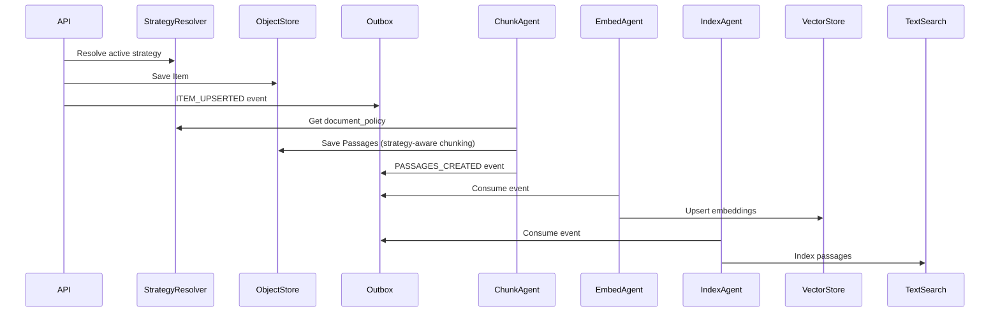
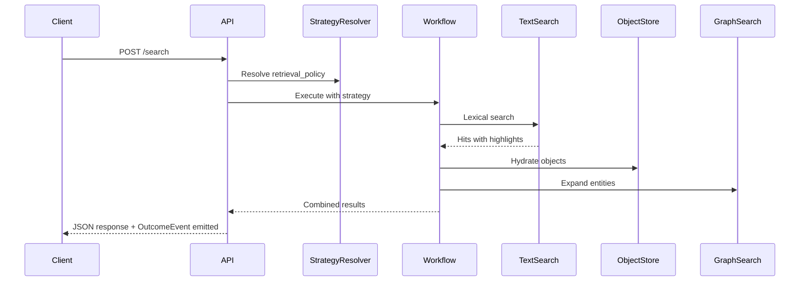
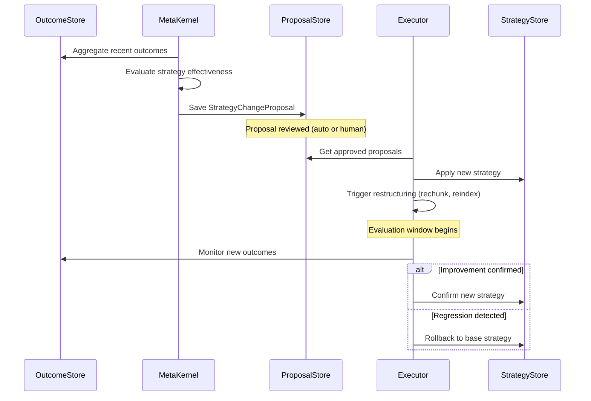

# Architecture Overview

CogMem is designed as a **framework-agnostic, self-evolving knowledge layer** that any AI agent can plug into. At its core is the **Knowledge Kernel** — a deterministic system that governs how information becomes knowledge. Above it sits the **Adaptive Cognitive Plane (ACP)** — a control layer that learns how to organize that knowledge more effectively over time.

## Design Principles

<CardGroup cols={2}>
  <Card title="Contract-First" icon="file-contract">
    Core contracts define interfaces without importing provider clients
  </Card>
  <Card title="Provider Isolation" icon="boxes-stacked">
    Database clients live behind provider implementations
  </Card>
  <Card title="Event-Driven" icon="bolt">
    Agents communicate via outbox events for loose coupling
  </Card>
  <Card title="Multi-Tenant" icon="users">
    Every object scoped by tenant_id for isolation
  </Card>
  <Card title="Structure as Hypothesis" icon="flask">
    Every structural choice is a testable hypothesis, not a fixed decision
  </Card>
  <Card title="Safe Self-Evolution" icon="shield-halved">
    All structural changes are proposed, reversible, and auditable
  </Card>
</CardGroup>

## System Layers

```
┌─────────────────────────────────────────────────────────┐
│                    API Layer                             │
│              FastAPI HTTP + MCP Server                   │
├─────────────────────────────────────────────────────────┤
│             Adaptive Cognitive Plane (ACP)               │
│  Meta-Kernel │ StrategyResolver │ RestructuringExecutor  │
├─────────────────────────────────────────────────────────┤
│                Knowledge Workflows                       │
│   EntityDossier │ TimelineBuilder │ ContradictionReport  │
├─────────────────────────────────────────────────────────┤
│                  Knowledge Kernel                        │
│    Admission │ Transformation │ Conflict │ Maintenance  │
├─────────────────────────────────────────────────────────┤
│                    Contracts                             │
│  ObjectStore │ StrategyStore │ OutcomeStore │ TextSearch │
│  VectorSearch │ GraphSearch │ ProposalStore              │
├─────────────────────────────────────────────────────────┤
│                    Providers                             │
│   Postgres │ OpenSearch │ Neo4j │ Qdrant │ SurrealDB    │
├─────────────────────────────────────────────────────────┤
│                  Agent Subsystem                         │
│  ChunkAgent │ EmbedAgent │ EntityExtract │ ClaimExtract │
└─────────────────────────────────────────────────────────┘
```

The **Adaptive Cognitive Plane** is the key addition. It observes how the system performs, evaluates whether the current memory strategy is effective, and proposes structural changes when it detects a better approach — all safely and reversibly.

## Data Flow

### Ingestion Flow



### Query Flow



### Self-Evolution Flow



## Core Domain Objects

| Object | Description | Key Fields |
|--------|-------------|------------|
| **Item** | Source document | kos_id, tenant_id, title, content_text, source |
| **Passage** | Text chunk | kos_id, item_id, text, span, extraction_method, confidence |
| **Entity** | Named entity | kos_id, name, entity_type, aliases, created_from |
| **Claim** | Structured assertion | kos_id, subject_entity_id, predicate, object, evidence_passage_ids, confidence, conflicts_with |
| **Artifact** | Generated content | kos_id, artifact_type, workflow_id, entity_scope, claim_ids, rendered_content |
| **KernelEvent** | Kernel decision log | kos_id, event_type, payload, created_at |
| **MemoryStrategy** | Self-evolving knowledge config | kos_id, scope_type, retrieval_policy, document_policy, vector_policy, graph_policy, claim_policy |
| **OutcomeEvent** | Feedback signal | kos_id, strategy_id, outcome_type, metrics, source |
| **StrategyChangeProposal** | Proposed restructuring | kos_id, base_strategy_id, proposed_strategy_id, risk_level, status |

## Import Rules

<Warning>
These rules are strictly enforced:

- **Core contracts** must NOT import provider clients (opensearch, neo4j, etc.)
- **Agents** must only import core and contracts
- **Providers** must NOT import FastAPI
- **Adapters** wrap external frameworks (LangChain, CrewAI, etc.)
- **ACP services** must only import core contracts and models — never providers directly
</Warning>

## Next Steps

<CardGroup cols={2}>
  <Card title="Adaptive Cognitive Plane" icon="arrows-rotate" href="/architecture/adaptive-cognitive-plane">
    How the system evolves itself
  </Card>
  <Card title="Knowledge Kernel" icon="brain" href="/architecture/agents">
    Explore the cognitive core
  </Card>
  <Card title="Contracts" icon="file-contract" href="/architecture/contracts">
    Learn about core interfaces
  </Card>
  <Card title="Knowledge Workflows" icon="route" href="/architecture/knowledge-workflows">
    See workflow strategies
  </Card>
</CardGroup>
